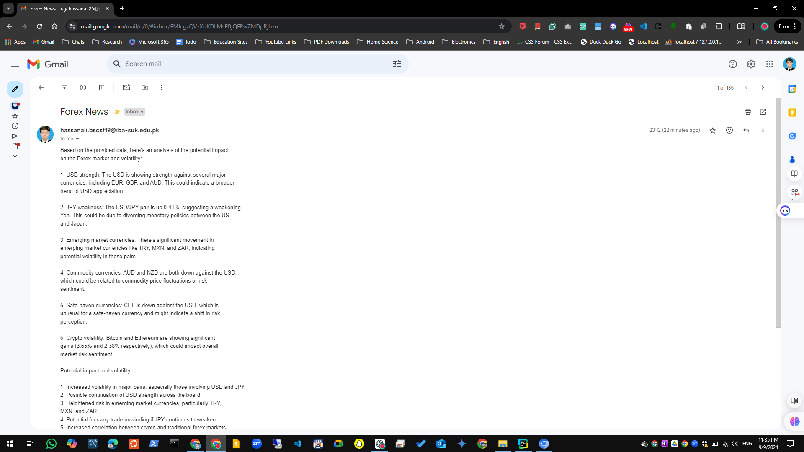

# Forex Future: Claude AI-Driven Currency Exchange News Generation and Trend Predictions
## Introduction

This is a dynamic application designed to streamline forex trading by leveraging AI and automation. This project integrates powerful technologies to analyze financial news and predict currency exchange trends, providing users with timely insights to stay ahead of the market.

Key components of this project include:

- **Playwright**: Used for fetching real-time forex data from site https://www.investing.com/currencies/streaming-forex-rates-majors , ensuring you always have the most up-to-date information for accurate predictions.
- **Claude AI**: The core of the project, Claude AI analyzes financial news to generate insightful predictions on currency exchange movements, helping traders make informed decisions based on future trends.
- **Google Email API**: To keep users informed, this system sends AI-generated forex news and trend predictions directly to clients’ Gmail inboxes, ensuring they never miss a critical update.

By combining these technologies, **Forex Future** offers a seamless solution for analyzing currency markets and delivering actionable insights directly to users.


### Installing Dependencies

Once you have cloned the repository, you can easily install all the required dependencies listed in the `requirements.txt` file. Follow these steps:

1. **Ensure you're in the project directory**:
   Navigate to the root folder of the project:
   ```bash
   cd forex-trade-project
   ```

2. **Install dependencies**:
   Use the following command to install all the required Python libraries at once:
   ```bash
   pip install -r requirements.txt
   ```

This will install all the necessary packages, including Playwright, Flask, and others, ensuring your environment is ready to run the project.

If you haven’t already, install Playwright’s browser binaries:
   ```bash
   playwright install
   ```
To run this project chrome will run in debug mode.Ensure that the path to Chrome is correctly set in the script:
    python
    win_chrome_path = 'C:/Program Files/Google/Chrome/Application/chrome.exe'
This is getting data after every 30 minutes and feed this data to claude sonnet3.5 for next trend.

**Run Flask and Scraping**:
    To run the project, execute the following command:
    bash
    python app.py

After this it will acces the forex trade website and acces the tabular data for currencies exhange . Then data will feed to  claude sonnet 3.5 for predictions and news generation . The model is getting current data after every 30 minutes. Each time, After news generation it will send email to recipients. In the email you will found out the exchnge rates for different currency pairs , volatility of a currency and many more on this for a reference a sample of emails is atatched below.




